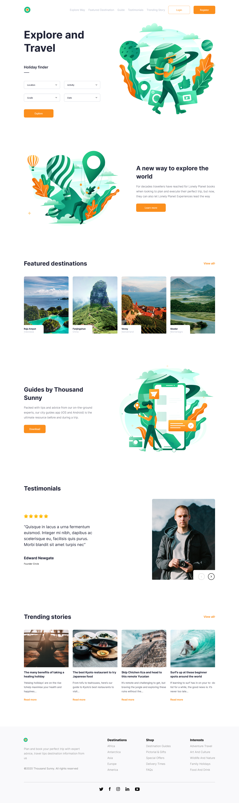

## explore and travel landing page


- Author: Yossef alatter
- [Demo](https://explore-travel-landingpage.vercel.app/)

---
## Description

I download the desgin of the page then start to write the HTML and CSS code for it, I build it to be responsive in several screens, then I start to write javascript code to it so i can complete requirements of the project 

- Sections links add to navbar dynamically 
- user can move between sections by using navbar
- user can use scroll top btn to move to the head of the page

## requirements and code 

""Sections links add to navbar dynamically""
```
//== adding item to navbar dynamically ==//
//== start ==//

//== handle elements that we need from DOM ==//
//== start ==//
const sections = document.querySelectorAll('section');
const navList = document.querySelector('.nav-list');
const fragmentDOM = document.createDocumentFragment();
//== end =//

//== function we need ==//
//== start ==//

//== create navlink ==//
function createNavLink(el){
    let navLink = document.createElement('li');
    navLink.classList.add('nav-link')
    navLink.textContent = el.getAttribute('data-nav');
    fragmentDOM.appendChild(navLink);
}

//== end ==//

//== creating nav list item according to sections in page ==//
//== start ==//
sections.forEach(createNavLink);
navList.appendChild(fragmentDOM);
//== end ==//

//== end ==//

```